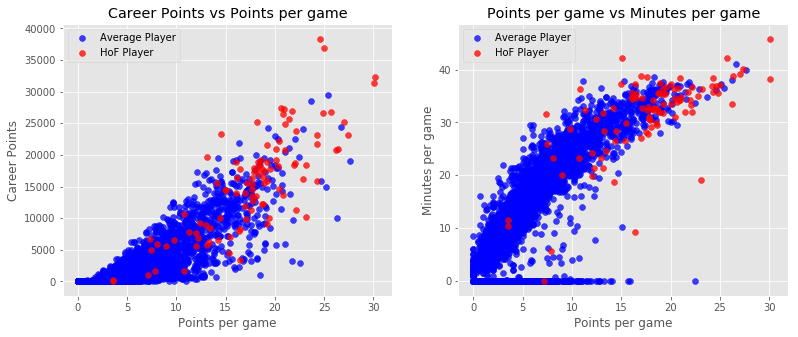
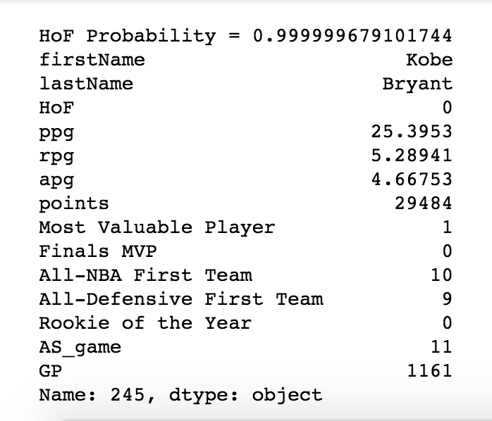

# Basketball Data Analysis
Exploratory data analysis of historical NBA basketball statistics using Python.
Using logistic regression model to predict which NBA players will be voted into the Hall of Fame.

Source Data: [Kaggle - Open Source Sports] (https://www.kaggle.com/open-source-sports/mens-professional-basketball) 

This project involved data cleaning, data visualization, feature engineering, and logistic regression model building.

**Data Cleaning**

From the below scatter plots, we can see Hall of Fame-inducted players score more on average and play more minutes than players that have not been inducted into the Hall of Fame.

**Logistic Regression Model**

The source data is vintage 2011. Of 3744 players tracked in data set, only 100 players have been inducted to the Hall of Fame. There have been nine years of Hall of Fame inductees not yet captured by the data set. 

The key awards captured to determine Hall of Fame probability included Most Valuable Player, Rookie of the Year, Finals MVP, All-NBA First Team, and All-Defensive First Team.
Relevant statistics to classify Hall of Fame players included total career points, points per game, rebounds per game, assists per game, total games played and All Star Game appearances.

The model accurately predicted the first 10 inductees, sorted by highest probability with Kobe Bryant at the top. Kobe Bryant was inducted into the Hall of Fame in 2020. 
